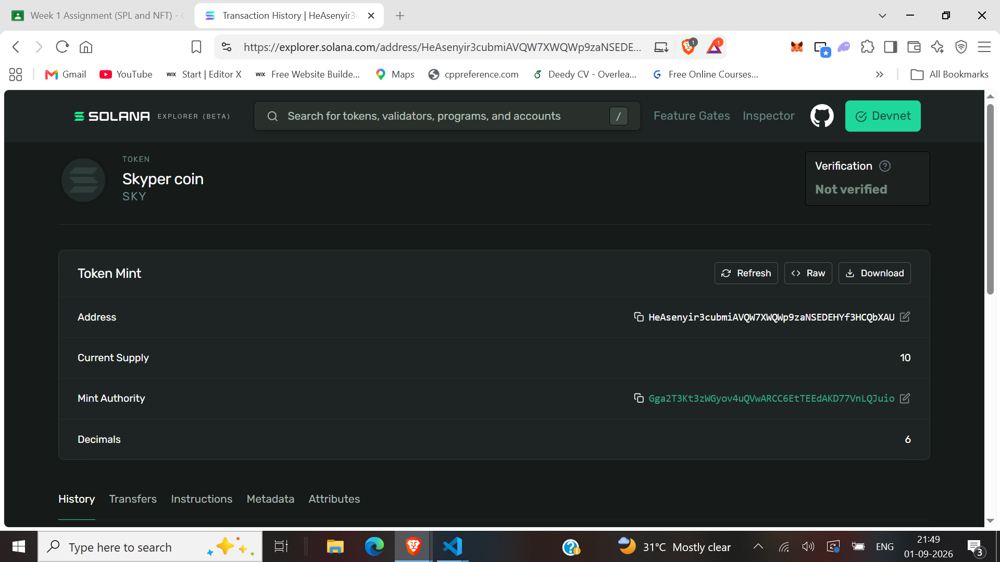
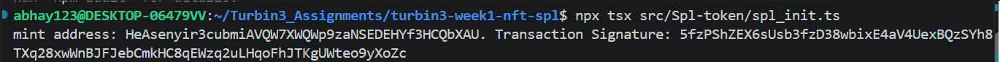
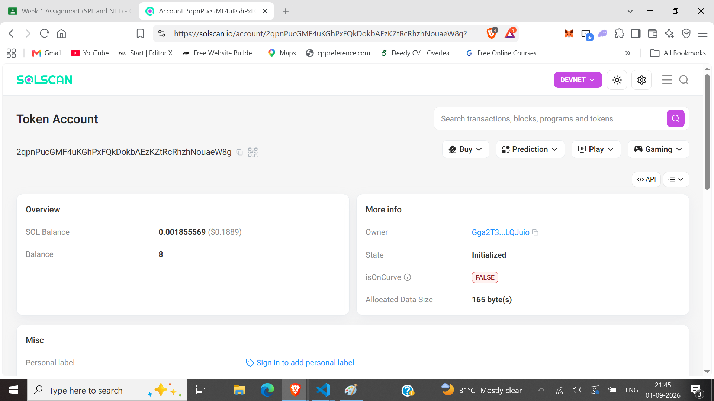
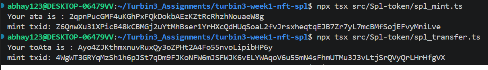
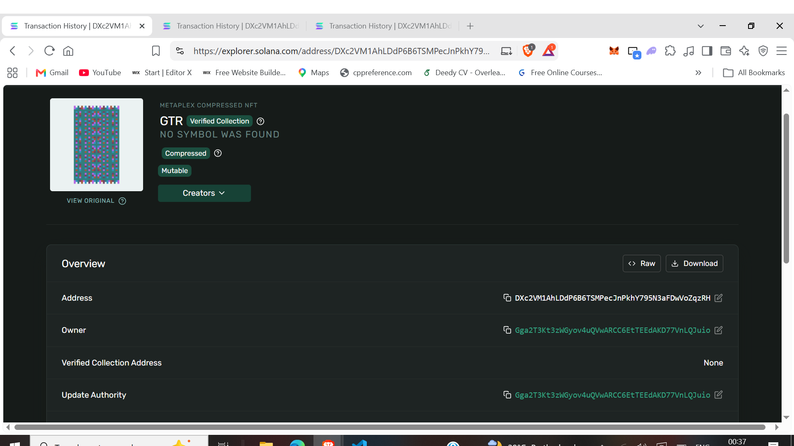
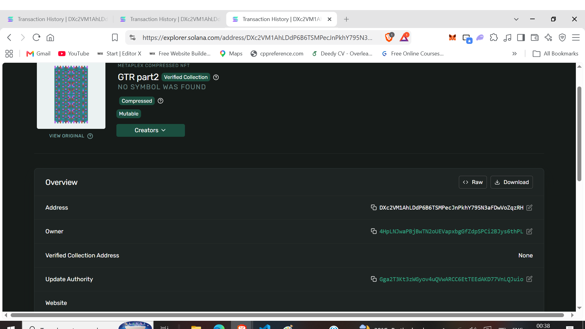

# Turbin3 Week 1 — SPL Token & MPL Core NFT and some experiments on NFTs

I wrote scripts demonstrating core Solana token and NFT operations on devnet: minting and transferring an SPL token, and minting, updating, and transferring ownership of an MPL Core NFT.

## Setup

```bash
npm install
```
Place your devnet wallet keypair JSON at the project root as `myWallet.json` (gitignored — never commit this file). Fund it with devnet SOL:

```bash
solana airdrop 2 --url devnet
```

## Tasks

### 1. Mint and transfer SPL token
`src/Spl-token/spl_init.ts` - this creates a new SPL token mint, mints supply to the payer's associated token account (ATA), then transfers a portion to a second wallet's ATA.

```bash
npx tsx src/Spl-token/spl_init.ts
```

`src/Spl-token/spl_metadata.ts` this part of code adds on-chain name/symbol/URI metadata to the token via the Token Metadata program.

### 2. Mint NFT using MPL Core
`src/NFT/nft_mint.ts` - mints a Core NFT asset (single account, no separate mint/metadata/master-edition accounts like legacy Token Metadata NFTs).

```bash
npx tsx src/NFT/nft_mint.ts
```

### 3. Update NFT name and metadata as update authority
`src/NFT/nft_update.ts` this is a new file in NFT that is update which calls `update()` on the minted asset to change its name and metadata URI, using the same wallet that holds `updateAuthority`.

```bash
npx tsx src/NFT/nft_update.ts
```

# Optional Assignment: 

### 4. Recreate NFT minting (extension)
`src/NFT2/nft_mint2.ts` — mints a second, separate Core NFT, kept independent from the Task above so it can be used to demonstrate transfer and burn without affecting the original.

### 5. Transfer NFT ownership between wallets (extension)
`src/NFT2/nft_ownership_transfer.ts` this generates a new wallet and calls `transfer()` to reassign the `owner` field on the Task 4 asset.

```bash
npx tsx src/NFT2/nft_ownership_transfer.ts
```

### 6. Burn NFT and reclaim rent (extension)
`src/NFT2/nft_burn.ts` this burns a Core NFT asset, closing the account and returning its rent-exempt SOL deposit to the owner's wallet. But this file is not actually working for now like I am not able to burn the asset I do not know why, code seems fine to me

```bash
npx tsx src/NFT2/nft_burn.ts
```

> **Status:** burn logic implemented; currently debugging an issue where the account is only partially cleared rather than fully closed on this asset. Will update once resolved.

## Repository Structure

```
src/
├── Spl-token/
│   ├── spl_init.ts        # Task 1: mint + transfer SPL token
│   └── spl_metadata.ts    # SPL token metadata
├── NFT/
│   ├── nft_mint.ts         # Task 2: mint Core NFT
│   └── nft_update.ts       # Task 3: update name/metadata
└── NFT2/                 # this NFT2 folder for the extension task(Optional one) 
    ├── nft_mint2.ts               # Task 4: mint second Core NFT
    ├── nft_ownership_transfer.ts  # Task 5: transfer ownership
    └── nft_burn.ts                # Task 6: burn + reclaim rent
```

## Screenshots

## Task1 SPL token Proofs:


*As u can see the mintaccount holds the total supply as 10 SKY tokens*.




*this is where i initially minted the SKY tokens then after i transfer it to different address*.


*this is where i transfered 2 SKY tokens*



## Task2 NFT minting



*this is the NFT i minted first with my own wallet address*

## Task3 updating the name and metadata


*this is the updated NFT as u can see the name is updated, owner is same.

## Task4 was the extension task for transfering the ownership between wallets


*Here I created another random keypair signer with umi and i transfered NFT ownership to that random address, as u can see the owner is different now but upgrade authority is same as previous one*